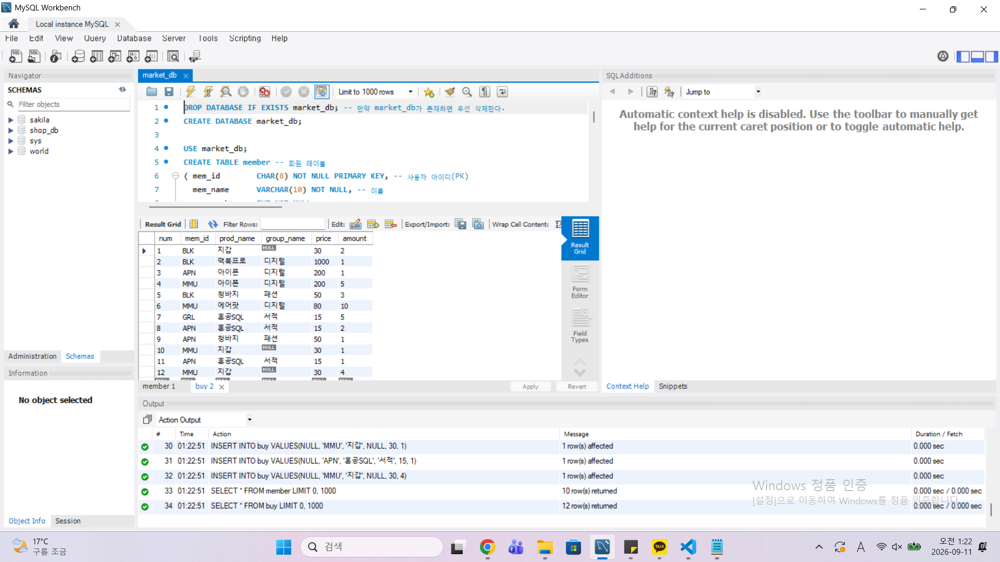
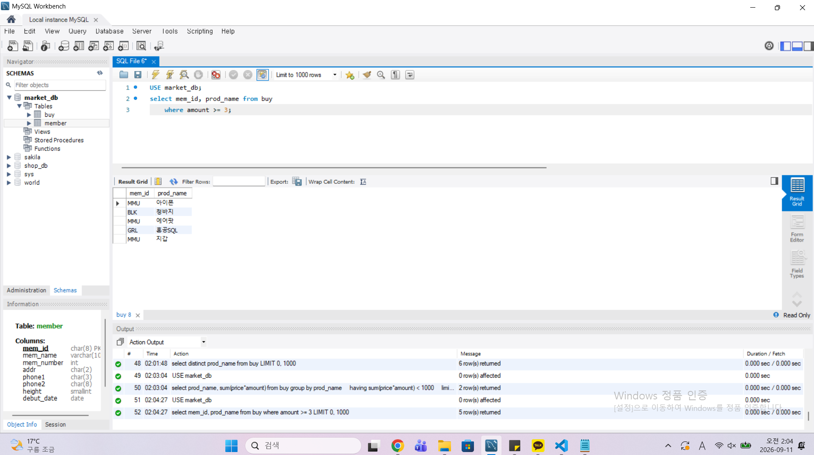
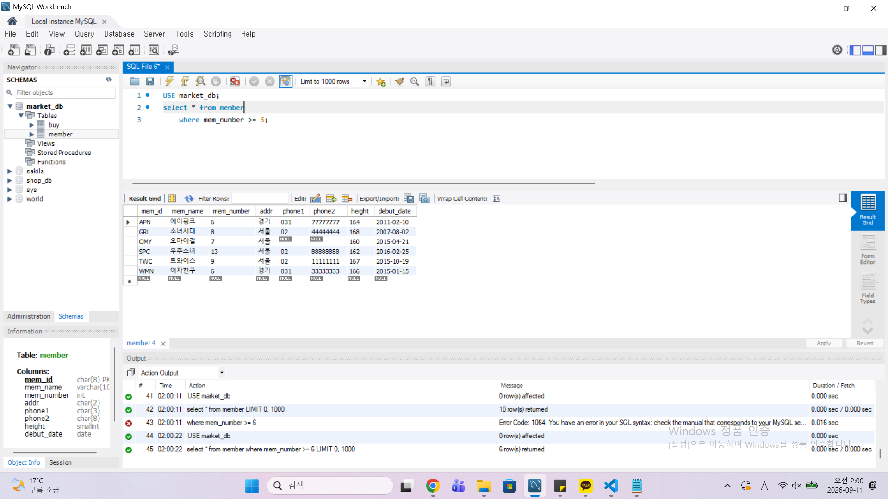
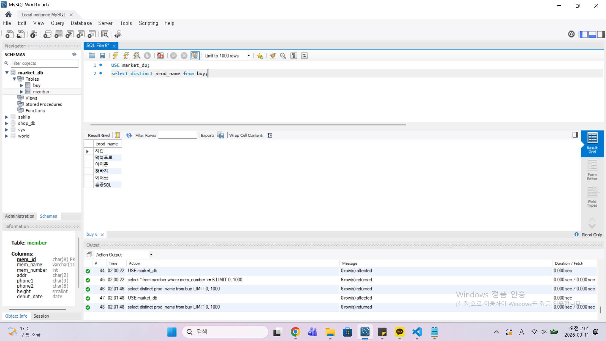
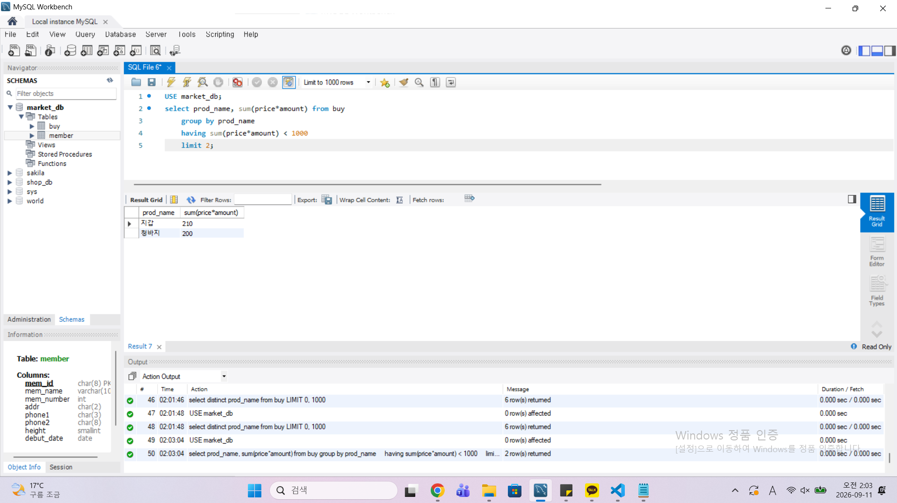

# SQL_ADVANCED 2주차 정규 과제 

📌SQL_ADVANCED 정규과제는 매주 정해진 분량의 『*혼자 공부하는 SQL*』 을 읽고 학습하는 것입니다. 이번주는 아래의 **SQL_ADVANCED_2nd_TIL**에 나열된 분량을 읽고 공부하시면 됩니다.

아래의 문제를 풀어보며 학습 내용을 점검하세요. 문제를 해결하는 과정에서 개념을 스스로 정리하고, 필요한 경우 제시된 강의를 참고하여 보완하는 것이 좋습니다.

<!-- 강의 링크는 아래와 같습니다.
https://www.youtube.com/watch?v=_JURyg_KzHE&list=PLVsNizTWUw7GCfy5RH27cQL5MeKYnl8Pm&index=7
https://www.youtube.com/watch?v=6qkPy7RfLqQ&list=PLVsNizTWUw7GCfy5RH27cQL5MeKYnl8Pm&index=8
https://www.youtube.com/watch?v=WWAFAm9op2U&list=PLVsNizTWUw7GCfy5RH27cQL5MeKYnl8Pm&index=9
-->

**교재 실습 예제 파일은 08_SQL_ADVANCED_Template 레포지토리의 src 폴더에 업로드되어 있습니다. market_db 파일도 해당 폴더에 함께 포함되어 있으니 참고하시기 바랍니다.**

**👀(수행 인증샷은 필수입니다.)** 

## SQL_ADVANCED_2nd_TIL

### 3장 SQL 기본 문법
#### 01. 기본 중에 기본 SELECT ~ FROM ~ WHERE
#### 02. 좀 더 깊게 알아보는 SELECT문
#### 03. 데이터 변경을 위한 SQL문


## Study Schedule

| 주차  | 공부 범위     | 완료 여부 |
| ----- | ------------- | --------- |
| 1주차 | p.24~99    | ✅         |
| 2주차 | p.102~155   | ✅         |
| 3주차 | p.158~213  | 🍽️         |
| 4주차 | p.216~271 | 🍽️         |
| 5주차 | p.274~327 | 🍽️         |
| 6주차 | p.330~369 | 🍽️         |
| 7주차 | p.372~407 | 🍽️         |


<br>

<!-- 여기까진 그대로 둬 주세요-->

---

# 1️⃣ 학습 내용 정리

## 1. 기본 중에 기본 SELECT ~ FROM ~ WHERE

<!-- 기본적인 SQL 문법에 관해 배우게 된 점을 적어주세요. -->

<!-- 과제 페이지를 참조하여 인증 사진 2장을 아래의 부분을 지우고 제출해주세요. -->



1. Select 구문
SELECT select_expr -- (열_이름)
    [FROM table_references] -- (테이블_이름)
    [WHERE where_condition] -- (조건식)
    [GROUP BY {col_name:expr:position}] -- (열_이름)
    [HAVING where_condition] -- (조건식)
    [ORDER BY {col_name:expr:position}] -- (열_이름)
    [LIMIT {[offest,] row_count: row_count OFFEST offest}] -- (숫자)

(간단한 버전)
SELECT select_expr -- (열_이름)
    [FROM table_references] -- (테이블_이름)
    [WHERE where_condition] -- (조건식)

2. FROM 뒤에 올 내용
1) USE를 통해 사용할 테이블의 스키마(데이터베이스)를 미리 설정한 경우
FROM member;

2) USE를 통해 사용할 테이블로 지정한 스키마(데이터베이스)와 다른 스키마를 사용할 경우
FROM marked_db.member;

3. LIKE : 문자열의 일부 글자를 검색하려는 경우에 사용
- 이때 첫 글자가 '우'로 시작하는 회원을 검색하고자 할 때 : WHERE mem_name LIKE '우%';
+) EXCEL에서 그 뒤 무엇이든 허용한다는 의미의 기호인 '*'와 달리 SQL에서는 '%'를 사용

4. 언더바(_) : 한 글자와 매치하기 위해서 사용하는 경우 
+) 만약 두 글자를 매치하기 위해서는 언더바(_)를 두 번 사용한다.


> **확인문제: 주소의 지역이 서울, 경기인 회원을 추출하는 SQL 문입니다. 빈칸에 들어갈 수 있는 것을 모두 고르세요.**

```sql
SELECT *
FROM table
WHERE ________;
```

보기는 아래와 같습니다.
```
1. addr IN('서울', '경기')
2. addr BETWEEN '서울' AND '경기'
3. addr = '서울' OR addr = '경기'
4. addr = '서울' AND addr = '경기'
```

```
Answer : 1, 3
1 : IN 연산자는 지정된 괄호 안의 '값 목록'내에 대상 컬럼의 값이 존재하는지 확인한다. 따라서 addr 컬럼의 데이터들 중에서 괄호 안의 원소인 '서울'과 '경기'와 일치하는 데이터를 발견될 때 해당 조건식이 True로 평가된다. 따라서 주소의 지역이 서울, 경기인 회원을 추출한다.

3 : OR은 논리합 연산자로, 연결된 두 개의 독립적인 조건식 중 하나라도 True이면 전체 조건을 True로 반환한다. 따라서 addr 값이 '서울'이거나 '경기'인 두 가지 경우를 모두 True로 반환하기 떄문에 주소의 지역이 서울, 경기인 회원을 추출한다. 
```


## 2. 좀 더 깊게 알아보는 SELECT문

<!-- ORDER BY절과 GROUP BY절 그리고 HAVING절에 관해 배우게 된 점을 적어주세요. -->

```
여기에 배우게 된 점을 적어주세요!
ORDER BY절 
- 결과의 값이나 개수에 대해서는 영향을 미치지 않지만, 결과가 출려되는 순서를 조절한다. 
- 기본값은 ASC로 오름차순이고, 내림차순을 원하는 경우에는 DESC로 입력
- ORDER BY절은 WHERE절 다음에 나와야 한다. (순서를 지키지 않으면 오류 발생)
- 정렬 기준은 1개 열이 아니라 여러 개 열로 지정할 수 있다. (순서에 맞춰 정렬이 적용된다)
+) LIMIT : 출력하는 개수를 제한한다. (형식 : LIMIT 시작, 개수 -> LIMIT 3 == LIMIT 0, 3)

GROUP BY절
- 집계함수와 같이 사용된다. (이때 집계함수와 같이 작성된 값은 SELECT뒤에 작성하게 된다.)

HAVING절:
- WHERE과 비슷한 개념으로 조건을 제한하지만, 집계 함수에 대해서 조건을 제한한다는 부분이 다르다. 

```

> **확인문제: 다음 표는 주요 집계함수를 정리한 것입니다. 각 설명에 해당하는 올바른 함수명을 기호에 맞게 작성하세요.**

| 함수명 | 설명 |
|--------|------|
| SUM() | 합계를 구합니다. |
| (ㄱ) | 평균을 구합니다. |
| (ㄴ) | 최소값을 구합니다. |
| MAX() | 최대값을 구합니다. |
| (ㄷ) | 행의 개수를 셉니다. |
| (ㄹ) | 행의 개수를 셉니다 (중복은 1개만 인정). |

```
여기에 답을 적어주세요!
(ㄱ) AVG()
(ㄴ) MIN()
(ㄷ) COUNT()
(ㄹ) COUNT(DISTINCT)
```


## 3. 데이터 변경을 위한 SQL문

<!-- INSERT문, UPDATE문, DELETE문에 관해 배우게 된 점을 적어주세요. -->

```
여기에 배우게 된 점을 적어주세요!
INSERT문
- 테이블 이름 다음에 나오는 열은 생략이 가능하나 생략할 경우에 VALUES 다음에 나오는 값들의 순서 및 개수는 테이블을 정의할 때의 열 순서 및 개수와 동일해야 한다. 
- 모든 열들에 대해 입력하고 싶지 않은 경우 해당 열의 위치 및 순서에 NULL을 작성한다. 
- INSERT INTO ~ SELECT 를 통해 다른 테이블의 데이터를 한 번에 입력할 수 있다. 
+) AUTO_INCREMENT 
- 열을 정의할 때 1부터 증가하는 값을 입력하고, 처음부터 NULL을 입력하여 아무것도 없다면 1부터 센다. 
- AUTO_INCREMENT로 지정하는 열은 PRIMARY KEY로 지정해줘야 한다.
- AUTO_INCREMENT = 100;으로 지정하여 처음부터 입력되는 값을 100으로 지정할 수 있다. 
- 항상 1씩 커지는 것이 아니라 시스템 변수인 '@@auto_increment_increment'를 이용하여 변경할 수 있다. 

UPDATE문
- 기존에 입력되어 있는 값을 수정하는 명령이다. 
- 콤마(.)로 분리해서 여러 개의 열을 동시에 변경할 수 있다. 
- UPDATE문에서 WHERE 절은 문법적으로 생략이 가능하지만, WHERE 절을 생략하면 테이블의 모든 행의 값이 변경된다. 

DELETE문
- 행 단위로 삭제된다. 
- LIMIT 구문과 함께 사용하여 조건을 지정할 수 있다. (WHERE 절 없이 사용하면 모든 행 데이터가 삭제된다.)
+) DELETE와 TRUNCATE
- 데이터의 양이 많아질 수록 DELETE를 활용하여 데이터를 삭제하게 되면 매우 많은 시간이 소요된다.
- DROP문은 테이블 자체를 삭제하여 순식간에 삭제된다.(테이블이 아예 사라짐)
- TRUNCATE문은 DELETE와 동일한 효과를 내지만 속도가 매우 빠르다. (빈 테이블을 남김)

```


# 2️⃣ 실습과제

다음 SQL 문을 작성하고 실행 결과를 확인 후 인증 사진을 아래에 업로드하세요.(market_db를 그대로 사용합니다.)

1. 모든 그룹 멤버의 정보를 조회하시오.
2. 멤버의 수가 6명 이상인 그룹 정보를 조회하시오.
3. 현재 구매 테이블에 존재하는 서로 다른 상품(prod_name)이 어떤 것이 있는지 조회하시오.
4. 총 구매 금액이 1000미만인 prod_name 중 상위 2개만 조회하시오.

1. 


2. 


3.


4. 


### 🎉 수고하셨습니다.


