# SQL_ADVANCED 4주차 정규 과제 

📌SQL_ADVANCED 정규과제는 매주 정해진 분량의 『*혼자 공부하는 SQL*』 을 읽고 학습하는 것입니다. 이번주는 아래의 **SQL_ADVANCED_4th_TIL**에 나열된 분량을 읽고 공부하시면 됩니다.

아래의 문제를 풀어보며 학습 내용을 점검하세요. 문제를 해결하는 과정에서 개념을 스스로 정리하고, 필요한 경우 제시된 강의를 참고하여 보완하는 것이 좋습니다.

<!-- 강의 링크는 아래와 같습니다.
https://www.youtube.com/watch?v=DMNpkj_bZIs&list=PLVsNizTWUw7GCfy5RH27cQL5MeKYnl8Pm&index=13
https://www.youtube.com/watch?v=BUHj-behLyc&list=PLVsNizTWUw7GCfy5RH27cQL5MeKYnl8Pm&index=14
https://www.youtube.com/watch?v=JrXWxku7ZIM&list=PLVsNizTWUw7GCfy5RH27cQL5MeKYnl8Pm&index=15
-->

**교재 실습 예제 파일은 08_SQL_ADVANCED_Template 레포지토리의 src 폴더에 업로드되어 있습니다. market_db 파일도 해당 폴더에 함께 포함되어 있으니 참고하시기 바랍니다.**

**👀(수행 인증샷은 필수입니다.)** 

## SQL_ADVANCED_4th_TIL

### 5장 테이블과 뷰
#### 01. 테이블 만들기
#### 02. 제약조건으로 테이블을 견고하게
#### 03. SQL 가상의 테이블: 뷰 


## Study Schedule

| 주차  | 공부 범위     | 완료 여부 |
| ----- | ------------- | --------- |
| 1주차 | p.24~99    | ✅         |
| 2주차 | p.102~155   | ✅         |
| 3주차 | p.158~213  | ✅         |
| 4주차 | p.216~271 | ✅         |
| 5주차 | p.274~327 | 🍽️         |
| 6주차 | p.330~369 | 🍽️         |
| 7주차 | p.372~407 | 🍽️         |


<br>

<!-- 여기까진 그대로 둬 주세요-->

---

# 1️⃣ 학습 내용 정리
## 1. 테이블 만들기 
### 1. 테이블의 기본 개념
**테이블(Table)** 은 데이터를 저장하는 기본 단위이다.

- **열(Column)**: 데이터의 속성
    - 예 : 아이디, 이름, 주소, 전화번호
- **행(Row / Record)**: 하나의 실제 데이터
- 하나의 데이터베이스 안에는 여러 개의 테이블을 생성할 수 있다.

예시 :
| mem_id | mem_name | addr |
|---|---|---|
| BLK | 블랙핑크 | 경남 |
| TWC | 트와이스 | 서울 |

- `mem_id`, `mem_name`, `addr` → 열(Column)
- 각 회원 한 줄 → 행(Row)

**설계** : 테이블을 만들기 전에 '설계'를 먼저 해야 한다. 
**테이블의 설계** : 는 테이블 이름, 열 이름, 데이터 형식, 기본 키 등을 설정하는 것이다.

### 2. GUI 환경에서 테이블 만들기
#### 데이터베이스 생성하기


#### 테이블 생성하기
[member 테이블 생성]
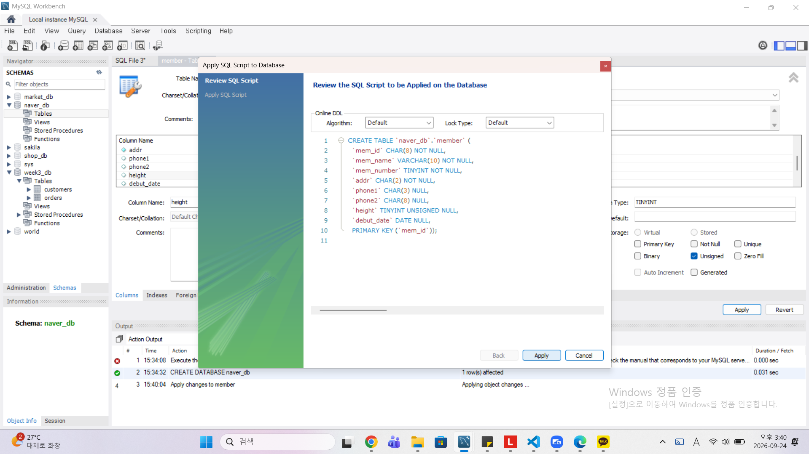

[buy 테이블 생성]


#### 데이터 입력하기
[member 테이블에 데이터 입력]


[buy 테이블에 데이터 입력]


### 3. SQL로 테이블 만들기
#### 데이터베이스 생성하기
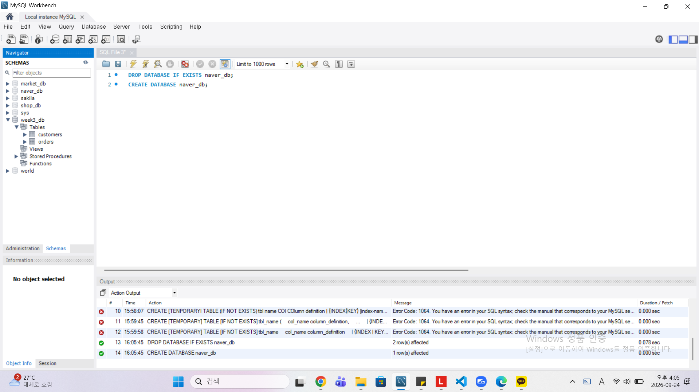

#### 테이블 생성하기
[member 테이블 생성]
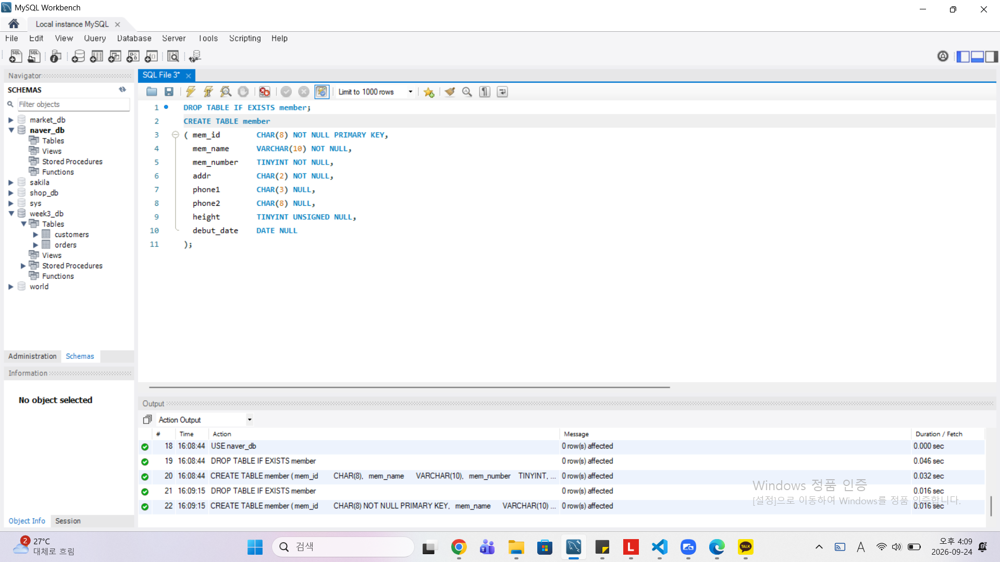

[buy 테이블 생성]
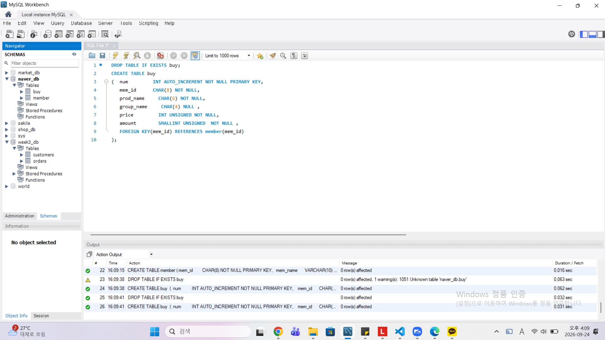

#### 데이터 입력하기
[member 테이블에 데이터 입력]
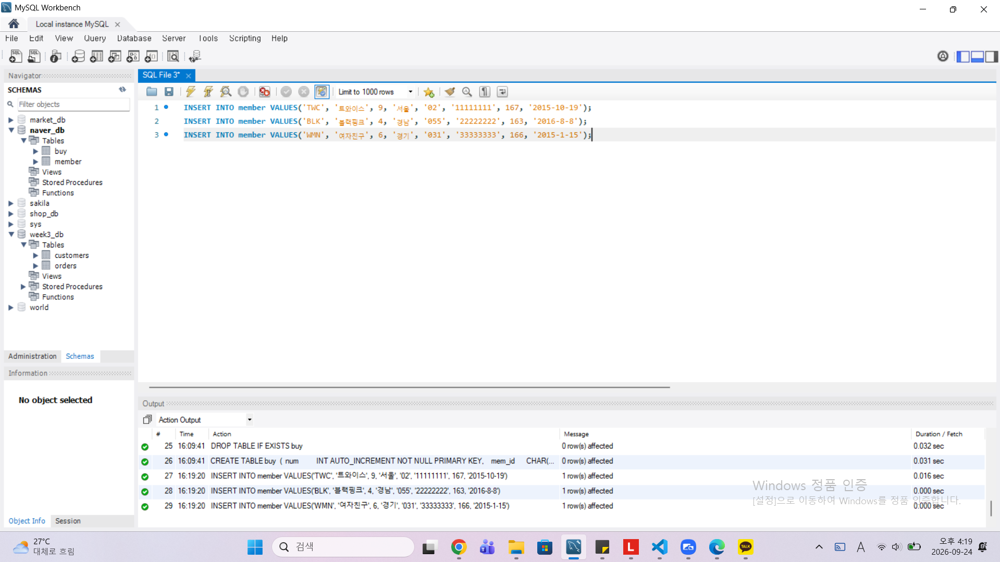

[buy 테이블에 데이터 입력]
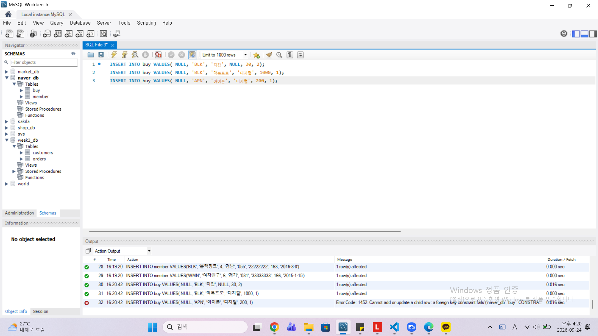

### 4. 핵심 정리
- **CREATE TABLE**은 테이블을 생성하는 SQL로 테이블 이름, 열 이름, 데이터 형식 등을 지정
- 열에 입력될 값이 1부터 자동 증가하도록 설정하려면 **GUI에서는 AI**를 체크하고, **SQL에서는 AUTO_INCREMENT**를 입력
- 열에 빈 값을 허용하지 않으려면 **GUI에서는 NN**을 체크하고, **SQL에서는 NOT NULL**을 입력
- 열을 기본 키로 지정하려면 **GUI에서는 PK**를 체크하고, **SQL에서는 PRIMARY KEY**를 입력
- 열을 외래 키로 지정하려면 FOREIGN KEY 에약어를 입력

### 5. 확인문제 정답
| 번호 | 정답 | 비고 |
|---|---|---|
| 1 | CHAR, VARCHAR |  |
| 2 | ① - UNSIGNED, ② - TINYINT, ③ - DATE, ④ - VARCHAR |  |
| 3 | ③ - UNSIGNED는 UN 부분을 체크한다. UQ는 Unique를 의미한다. |  |
| 4 | ③ - 기본키와 외래 키는 일반적으로 '서로 다른 테이블' 사이의 관계를 맺을 때 설정한다. 한 테이블 안에서 기본키와 외래 키를 함께 사용하는 경우(자가 참조 등)도 존재하지만, 일반적으로 두 테이블 간의 관계(부모-자식 관계)를 설정하는 데 사용 |  |
| 5 | 1행 : mem_id는 식별자인 PRIMARY KEY로 설정해야 한다. 외래 키(FOREIGN KEY)는 참조하는 쪽에서 설정 |  |
|  | 7행 : heihgt의 경우는 0보다 작은 음수가 들어올 수 없기 때문에 데이터 형식이 TINYINT에 UNSIGNED를 추가해서 'TINYINT UNSIGNED'로 나타내야 한다. |  |


## 2. 제약조건으로 테이블을 견고하게 
### 1. 제약조건의 기본 개념과 종류
**제약조건(Constraint)** 은 데이터의 무결성을 지키기 위해 제한하는 조건
(**데이터의 무결성** : '데이터에 결함이 없음'을 의미)

### 2. 기본 키 제약 조건
- **기본 키(Prinmary Key)** : 데이터를 구분할 수 있는 식별자
- 기본 키에 입력되는 값은 중복될 수 없으며, NULL 값이 입력될 수 없다. 
- 기본 키가 없어도 테이블 구성이 가능하지만 실무에서 사용하는 테이블에는 기본 키를 설정해야 중복된 데이터가 입력되지 않는다. 
- 테이블은 **기본 키를 1개만 가질 수 있다.** (하나의 열에만 기본 키를 설정, 어떤 열에 설정해도 문법상 문제는 없으나 테이블의 특성을 가장 잘 반영하는 열을 선택하는 것이 좋다.)

#### 2 - 1. CREATE TABLE에서 설정하는 기본 키 제약조건
- 열 이름 뒤에 **PRIMARY KEY**를 붙여주면 기본 키로 설정된다.
- 또는 제일 마지막 행에 **PRIMARY KEY(열 이름)**를 추가해도 된다. 
+) 테이블을 삭제하는 경우에 기본 키-외래 키 관계로 연결된 테이블은 **외래 키가 설정된 테이블을 먼저 삭제**해야 한다.

#### 2 - 2. ALTER TABLE에서 설정하는 기본 키 제약조건
- ALTER TABLE member
    ADD CONSTRAINT
    PRIMARY KEY (mem_id);
    로 PRIMARY KEY를 지정한 것은 CREATE TABLE로 PRIMARY KEY를 지정한 것과 동일한 결과를 갖는다. 
+) 기본 키는 별도의 이름이 없으며, DESCRIBE 명령으로 확인하면 그냥 PRI로만 나온다. 이때 **CONSTRAINT PRIMARY KEY PK_member_mem_id (mem_id)** 를 통해 이름을 붙여줄 수 있다. 

#### 3. 외래 키 제약조건
- **외래 키(FOREIGN KEY)** : 두 테이블 사이의 관계를 연결해주고, 그 결과 데이터 무결성을 보장해주는 역할을 한다. 
- 외래 키가 설정된 열은 꼭 다른 테이블의 기본 키와 연결된다.
- 기본 키가 있는 테이블은 **기준 테이블**이고, 외래 키가 있는 테이블은 **참조 테이블**이다. 

#### 3 - 1. CREATE TABLE에서 설정하는 외래 키 제약조건
- CREATE TABLE 끝에 **FOREIGN KEY(열_이름) REFERENCES 기준_-_테이를(열_이름)** 을 입력하여 외래 키를 설정한다. 
- 기준 테이블의 열이 **PRIMARY KEY 또는 Unique**가 아니라면 외래 키 관계는 설정되지 않는다. 

#### 3 - 2. ALTER TABLE에서 설정하는 외래 키 제약조건
- **ADD CONSTRAINT** 뒤에 FOREIGN KEY 설정하는 것과 동일하게 입력하면 된다.

#### 3 - 3. 기준 테이블의 열이 변경될 경우 (일반적인 경우)
- 기준 테이블의 열이 변경되면 두 테이블의 정보가 일치하지 않게 된다. 
- 따라서 기본 키 - 외래 키로 맺어진 후에는 기준 테이블의 열 이름이 변경되지 않는다. (열 이름이 변경되면 참조 테이블의 데이터에 문제가 발생하기 때문이다.)
- 변경뿐만이 아니라 삭제도 되지 않는다. 

#### 3 - 4. 기준 테이블의 열이 변경될 경우 (자동으로 변경되는 경우)
- **ON UPDATE CASCADE** : 기준 테이블의 열 이름이 변경될 때 참조 테이블의 열 이름이 자동으로 변경되는 기능
- **ON DELETE CASCADE** : 기준 테이블의 데이터가 삭제되면 참조 테이블의 데이터 자동적으로 삭제되는 기능

### 4. 기타 제약조건
#### 4 - 1. 고유 키 제약조건
- **고유 키(Unique) 제약조건** : 중복되지 않은 유일한 값을 입력해야 하는 조건
- 기본 키 제약조건과의 차이점 : 기본 키 제약조건과 달리 고유 키 제약 조건은 **NULL** 값을 허용하고, 고유 키는 여러 개를 설정해도 된다. 

#### 4 - 2. 체크 제약조건
- **체크(Check) 제약조건** : 입력되는 데이터를 점검하는 기능
- 열의 정의 뒤에 CHECK(조건)을 추가하여 해당 열에 입력될 수 있는 값의 조건을 지정할 수 있다. 
- Check constraint 오류는 체크 제약조건에서 설정한 값의 범위를 벗어나면 발생한다. 

#### 4 - 3. 기본값 정의
- **기본 값(Default) 정의** : 값을 입력하지 않았을 때 자동으로 입력될 값을 미리 지정해 놓는 방법
- CREATE TABLE에서는 열의 이름 및 조건 정의하는 부분의 마지막 부분에 **DEFAULT OOO**와 같이 지정할 수 있다. 
- ALTER TABLE 사용 시에는 **ALTER COLUMN**문을 사용하여 나타냄
- 데이터를 입력하는 경우에는 default라고 입력하여 열에 기본값을 입력할 수 있다. 

#### 4 - 4. 널 값 허용
- 널(NULL) 값을 허용하려면 생략하거나 NULL을 사용
- NULL 값은 '아무 것도 없다'라는 의미이므로, 공백('')이나 0과는 다르다. 


> **확인문제: 다음 보기 중에서 각 문항이 설명하는 것을 고르세요.**

보기는 아래와 같습니다.
```
CHECK / DEFAULT / PRIMAY KEY / UNIQUE / NOT NULL / FOREIGN KEY
```

1. 입력되는 데이터가 조건에 맞는지 검사하는 기능: **CHECK**
   - 입력된 값이 지정한 조건을 만족하는지 검사하는 제약조건

2. 값을 입력하지 않으면 자동으로 들어갈 값: **DEFAULT**
   - 값을 입력하지 않았을 때 미리 지정된 기본값이 자동으로 입력됨

3. 빈 값을 입력하는 것을 허용하지 않음: **NOT NULL**
   - NULL 값을 허용하지 않아 반드시 값이 입력되어야 함

[보기의 나머지는]
**PRIMARY KEY** : 각 행을 유일하게 구분하는 기본키
**UNIQUE** : 중복값을 허용하지 않음
**FOREIGN KEY** : 다른 테이블의 키를 참조하는 외래키


## 3. 가상의 테이블: 뷰 
### 1. 뷰의 개념
- 뷰(view)는 **데이터베이스 개체** 중 하나로, 한마디로 **가상의 테이블**로 표현
- 뷰의 실체는 SELECT 문으로 만들어져 있기 때문에 뷰에 접근하는 순간 SELECT가 실행되고 그 결과가 화면에 출려되는 방식으로 **테이블처럼 데이터를 가지고 있지는 않는다.**
- 뷰의 종류 中 **단순 뷰** : 하나의 테이블과 연관된 뷰
- 뷰의 종류 中 **복합 뷰** : 2개 이상의 테이블과 연관된 뷰

#### 1 - 1. 뷰의 기본 생성
##### 뷰를 만드는 형식
```
CREATE VIEW 뷰_이름
AS
   SELECT 문;
```
##### 뷰를 만든 후에 접근하는 방식
```
SELECT 열_이름 FROM 뷰_이름
   [WHERE 조건];
```
#### 1 - 2. 뷰의 작동
- 뷰는 기본적으로 **'읽기 전용'** 으로 사용되지만, 뷰를 통해서 **원본 테이블의 데이터를 수정할 수도 있다.** (몇 가지의 조건을 만족하는 경우)

#### 1 - 3. 뷰를 사용하는 이유
① **보안(Securtiy)** 에 도움이 된다. 
- 테이블에 접근하게 되면 모든 데이터가 노출되지만 뷰를 생성해서 **테이블에 접근하지 못하도록 권한을 제한하고, 뷰에만 접근할 수 있도록 권한을 준다면** 이러한 문제를 쉽게 해결할 수 있다. 

② 복잡한 SQL을 단순하게 만들 수 있다. 

### 2. 뷰의 실제 작동
#### 2 - 1. 뷰의 실제 생성, 수정, 삭제
##### 뷰의 생성
- **별칭** 을 사용하여 기본적인 뷰를 생성하면서 뷰에서 사용될 열 이름을 테이블과 다르게 지정할 수도 있다. (중간에 띄어쓰기 사용도 가능)
- 별칭의 사용 방법 : 열 이름 뒤에 작은따옴표 또는 큰따옴표로 묶어주고, 형식상 **AS** 를 붙여준다.
- 뷰를 조회할 때 **열 이름에 공백이 있으면 백팅(`)** 으로 묶어줘야 한다.
```
USE market_db;
CREATE VIEW v_viewtest1
AS
    SELECT B.mem_id 'Member ID', M.mem_name AS 'Member Name', 
            B.prod_name "Product Name", 
            CONCAT(M.phone1, M.phone2) AS "Office Phone" 
       FROM buy B
         INNER JOIN member M
         ON B.mem_id = M.mem_id;
         
SELECT  DISTINCT `Member ID`, `Member Name` FROM v_viewtest1;
```

##### 뷰의 수정
- **ALTER VIEW** 구문을 사용하여 수정하고, 열 이름에 한글을 사용해도 됨
- **단** , 열 이름에 한글을 사용하면 **한글 운영 체제 외에는** 인식되지 않을 수도 있어 권장하지는 않는다. 
```
ALTER VIEW v_viewtest1
AS
    SELECT B.mem_id '회원 아이디', M.mem_name AS '회원 이름', 
            B.prod_name "제품 이름", 
            CONCAT(M.phone1, M.phone2) AS "연락처" 
       FROM buy B
         INNER JOIN member M
         ON B.mem_id = M.mem_id;
         
SELECT  DISTINCT `회원 아이디`, `회원 이름` FROM v_viewtest1;
```

##### 뷰의 삭제
- **DROP VIEW** 를 사용하여 삭제한다. 
```
DROP VIEW v_viewtest1;
```

#### 2 - 2. 뷰의 정보 확인
- **DESCIBE** 문으로 기존에 생성된 뷰에 대한 정보를 확인할 수 있다. (DESCRIBE는 줄여서 DESC라고 써도 된다.)
- 테이블과 동일하게 정보를 보여주지만, PRIMARY KEY 등의 정보는 확인되지 않는다. 
+) **CREATE OR REPLACE VIEW** 는 기존에 뷰가 있어도 덮었쓰는 효과를 내기 때문에 **CREATE VIEW** 와 달리 기존에 뷰가 있어도 오류가 발생하지 않는다.
- **SHOW CREATE VIEW** 문으로 뷰의 소스 코드도 확인할 수 있다. (뷰를 생성할 때보다 훨씬 복잡하게 나오지만 핵심적인 코드는 생성할 때 사용한 코드와 동일

#### 2 - 3. 뷰를 통한 데이터의 수정/삭제
- 뷰를 통해서 데이터를 입력하려면, 뷰에서 보이지 않는 테이블의 열에 NOT NULL이 없어야 한다. 
- **UPDATE**, **DELETE** 문을 통해 데이터의 수정과 삭제가 가능하다. 

#### 2 - 4. 뷰를 통한 데이터의 입력
- **INSERT** 문을 통해 테이터를 입력할 수 있다.
- **WITH CHECK OPTION**을 통해 뷰에 설정된 값의 범위가 벗어나는 값은 입력되지 않도록 할 수 있다. 
- 뷰의 WITH CHECK OPTION은 설정한 범위의 데이터만 입력되도록 제한한다.
```
ALTER VIEW v_height167
AS
    SELECT * FROM member WHERE height >= 167
        WITH CHECK OPTION ;
        
INSERT INTO v_height167 VALUES('TOB','텔레토비', 4, '영국', NULL, NULL, 140, '1995-01-01') ;
```

#### 2 - 5. 뷰가 참조하는 테이블 삭제
- 뷰가 참조하는 테이블들을 삭제한 경우 **조회할 수 없다는 메시지** 가 나온다.
- 뷰가 조회되지 않으면 **CHECK TABLE** 문으로 뷰의 상태를 확인할 수 있다.

> **확인문제: 다음은 뷰의 특징입니다. 거리가 먼 것을 하나 고르세요.**

보기는 아래와 같습니다.
```
1️⃣ 뷰에는 테이블의 모든 열을 포함시켜야 합니다.
2️⃣ 뷰는 복잡한 SQL을 단순하게 만드는 효과가 있습니다.
3️⃣ 뷰는 보안에 도움이 됩니다.
4️⃣ 일부 사용자가 테이블에는 접근하지 못하게 하고, 뷰에만 접근하도록 설정할 수 있습니다.
```

```
답 : 1️⃣ 뷰에는 테이블의 모든 열을 포함시켜야 합니다.
이유
- 뷰는 원본 테이블의 모든 열을 반드시 포함할 필요가 없다.
- 필요한 열만 선택해서 뷰를 만들 수 있다.

반면, 
2️⃣ 복잡한 SQL을 단순하게 만들 수 있고,
3️⃣ 특정 데이터만 보여줄 수 있어 보안에 도움이 되며,
4️⃣ 사용자가 원본 테이블에는 접근하지 못하고 뷰에만 접근하도록 권한을 설정할 수도 있다.
```


---

# 2️⃣ 실습과제

## 1. 데이터베이스 구축

아래 코드를 MySQL Workbench에 붙여넣은 후,  
**전체 드래그 → 실행 (Ctrl + Shift + Enter)** 하여 데이터베이스를 생성하세요.

```sql
CREATE DATABASE IF NOT EXISTS week4_db;
USE week4_db;
```

## 2. 실습문제

1. 다음 조건을 만족하는 `users` 테이블을 생성하시오.
```
- user_id는 INT이며 **기본키(Primary Key)**로 설정합니다.
- name은 VARCHAR(20)이며 NULL을 허용하지 않습니다.
- email은 VARCHAR(50)이며 중복을 허용하지 않습니다.
- signup_date는 DATE 타입으로 설정합니다.
- grade는 INT이며 기본값(Default)을 1로 설정합니다.
```

2. 다음 조건을 만족하는 `orders` 테이블을 생성하시오.
```
- order_id는 INT이며 기본키(Primary Key)로 설정합니다.
- user_id는 INT이며 NULL을 허용하지 않습니다.
- amount는 INT이며 0보다 커야 합니다.
- order_date는 DATE 타입으로 설정합니다.
```

3. 다음 조건을 만족하여 데이터를 삽입하시오.
```
- users 테이블에 3명 이상의 데이터를 직접 INSERT 하시오. (단, user 중 본인이 포함돼야 함)
- orders 테이블에 3건 이상의 데이터를 직접 INSERT 하시오.
```

4. users와 orders 테이블을 활용하여 다음 컬럼을 보여주는 뷰 user_order_view를 생성하시오.
```
- user_id
- name
- amount
```

5. 생성한 user_order_view를 조회하시오.

## 3. 제출 방법

1. 각 문제의 실행 결과가 보이도록 화면을 캡처합니다.
2. 테이블 생성 결과, 데이터 삽입 결과, 뷰 생성 및 조회 결과가 모두 보이도록 제출합니다.
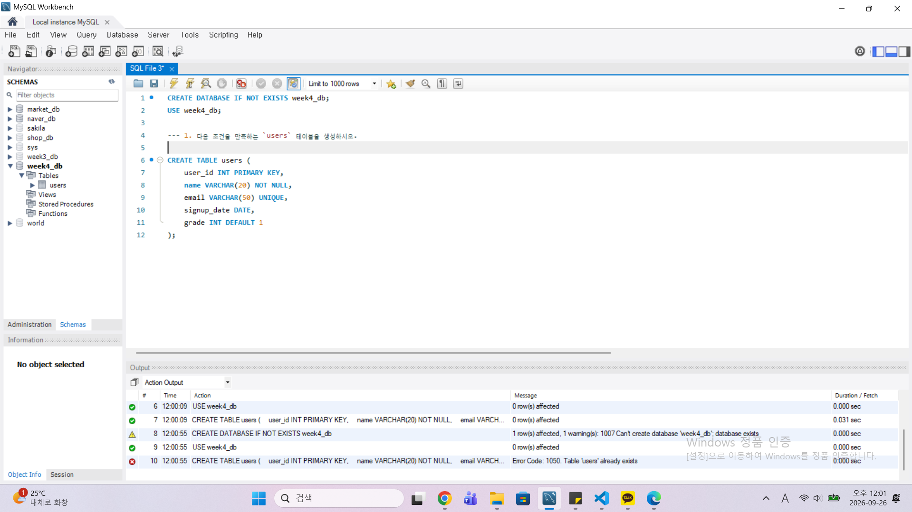
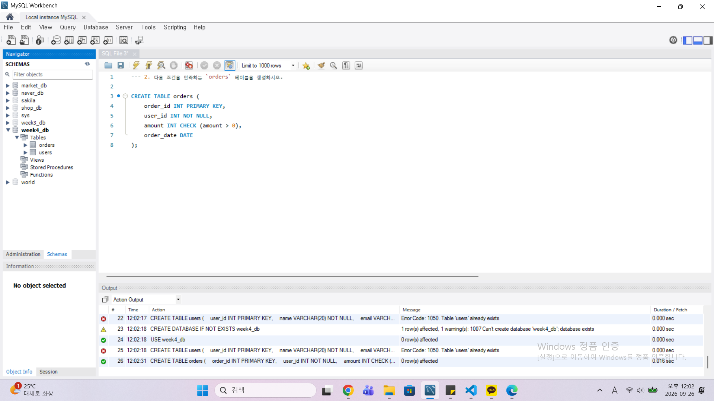
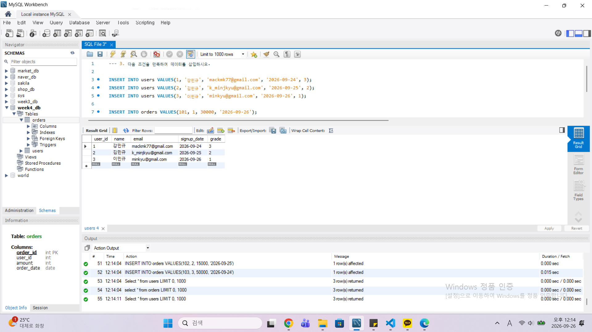
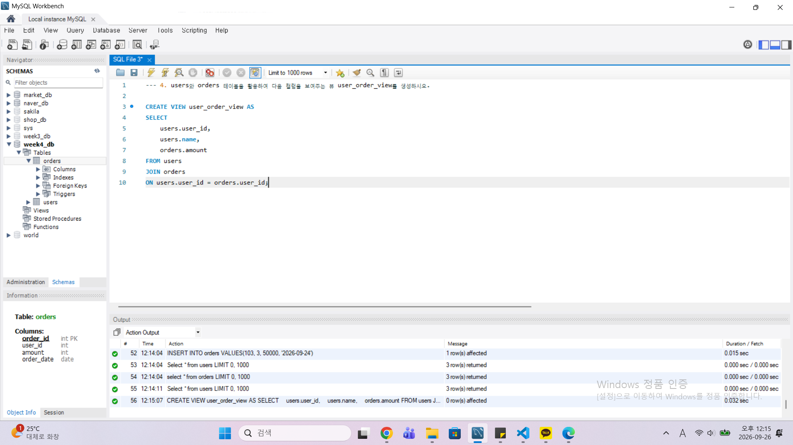
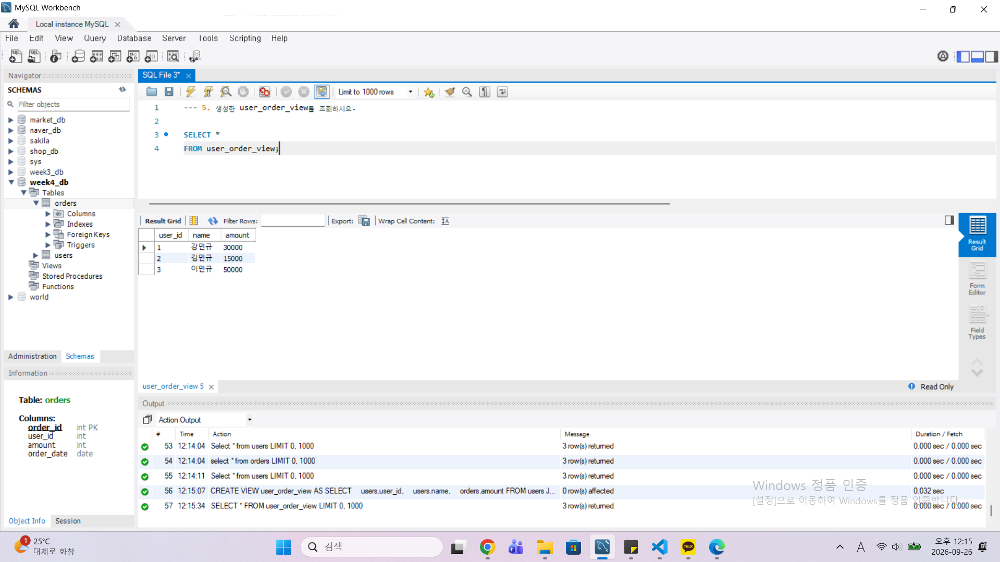

### 🎉 수고하셨습니다.


