# SQL_ADVANCED 5주차 정규 과제 

📌SQL_ADVANCED 정규과제는 매주 정해진 분량의 『*혼자 공부하는 SQL*』 을 읽고 학습하는 것입니다. 이번주는 아래의 **SQL_ADVANCED_5th_TIL**에 나열된 분량을 읽고 공부하시면 됩니다.

아래의 문제를 풀어보며 학습 내용을 점검하세요. 문제를 해결하는 과정에서 개념을 스스로 정리하고, 필요한 경우 제시된 강의를 참고하여 보완하는 것이 좋습니다.

<!-- 강의 링크는 아래와 같습니다.
https://www.youtube.com/watch?v=KZmW6VaY5BU&list=PLVsNizTWUw7GCfy5RH27cQL5MeKYnl8Pm&index=16
https://www.youtube.com/watch?v=vWTDuoSG-YQ&list=PLVsNizTWUw7GCfy5RH27cQL5MeKYnl8Pm&index=17
https://www.youtube.com/watch?v=aiMSluMNzI8&list=PLVsNizTWUw7GCfy5RH27cQL5MeKYnl8Pm&index=18
-->

**교재 실습 예제 파일은 08_SQL_ADVANCED_Template 레포지토리의 src 폴더에 업로드되어 있습니다. market_db 파일도 해당 폴더에 함께 포함되어 있으니 참고하시기 바랍니다.**

**👀(수행 인증샷은 필수입니다.)** 

## SQL_ADVANCED_5th_TIL

### 6장 인덱스
#### 01. 인덱스 개념을 파악하자
#### 02. 인덱스의 내부 작동
#### 03. 인덱스의 실제 사용  


## Study Schedule

| 주차  | 공부 범위     | 완료 여부 |
| ----- | ------------- | --------- |
| 1주차 | p.24~99    | ✅         |
| 2주차 | p.102~155   | ✅         |
| 3주차 | p.158~213  | ✅         |
| 4주차 | p.216~271 | ✅         |
| 5주차 | p.274~327 | ✅         |
| 6주차 | p.330~369 | 🍽️         |
| 7주차 | p.372~407 | 🍽️         |


<br>

<!-- 여기까진 그대로 둬 주세요-->

---

# 1️⃣ 학습 내용 정리

## 1. 인덱스 개념을 파악하자 
- **인덱스** : 데이터를 빠르게 찾을 수 있도록 도와주는 도구 (SELECT문의 출력 속도가 빨라짐)
- **인덱스의 종류** : 클러스터형 인덱스, 보조 인덱스
- **클러스터형 인덱스** : **기본 키** 로 지정하면 자동 생성되며 테이블에 1개만 만들 수 있다. 
- **보조 인덱스** : **고유 키**로 지정하면 자동 생성되며 여러 개를 만들 수도 있지만 **자동 정렬** 되지는 않는다. 

### 인덱스의 개념
-인덱스의 사용 여부에 따른 결과값의 차이는 없고, 그저 데이터를 빠르게 찾을 수 있도록 해주는 도구이다.

#### 인덱스의 문제점
- 인데스를 남용하게 된다면 오히려 더 오래 걸릴 수도 있다. 
- 따라서 마냥 인덱스가 있다고 무조건 좋은 것은 아니다.
+) **MySQL** 이 알아서 인덱스를 사용해서 검색하는 것이 빠를지 아니면 전체 테이블을 검색하는 것이 빠를지 판단할 수 있다. 

#### 인덱스의 장점과 단점
##### 1. 인덱스의 장점
- 적절한 인덱스를 생성하고 인덱스를 사용하는 SQL을 만든다면 기존보다 아주 빠른 **응답 속도** 를 얻을 수 있다. 
- 컴퓨터 입장에서는 적은 처리량으로 요청한 결과를 빨리 얻을 수 있어 여유가 생기고 추가로 많은 일을 할 수 있게 되어 **전체 시스템의 성능이 향상된다.**

##### 2. 인덱스의 단점
- 인덱스는 대략 테이블 크기의 10% 정도의 공간이 추가로 필요하다.
- 처음에 인덱스를 만드는 데 시간이 오래 걸리 수 있다.
- SELECT가 아닌 데이터의 변경 작업(INSERT, UPDATE, DELETE)이 자주 일어나면 오히려 성능이 나빠질 수 있다. 

### 인덱스의 종류
- 클러스터형 인덱스와 보조 인덱스로 나눌 수 있다. 
- 쉽게 비교하면 **클러스터형 인덱스** 는 영어사전과 같고, **보조 인덱스** 는 책의 뒤에 찾아보기가 있는 일반적인 책과 같다.

#### 자동으로 생성되는 인덱스
- 인덱스는 **테이블의 열(칼럼)** 단위에 생성되며, 하나의 열에 하나의 인덱스를 생성할 수 있다. 
+) 하나의 열에 여러 개의 인덱슬르 생성할 수도 있고, 여러 개의 열을 묶어서 하나의 인덱스를 생성할 수도 있지만 상당히 드문 경우이다. 
- 예시
```sql
CREATE TABLE member
( mem_id      CHAR(8) NOT NULL PRIMARY KEY, 
  mem_name        VARCHAR(10) NOT NULL,
  mem_number    TINYINT  NOT NULL,
  addr          CHAR(2) NOT NULL,
  phone1        CHAR(3),
  phone2        CHAR(8),
  height        TINYINT UNSIGNED,
  debut_date    DATE
);
```
이때 member 정의 시 회원 아이디(mem_id)를 기본 키로 정의했다.
이와 같이 기본 키로 지정하면 자동으로 mem_id열에 클러스터형 인덱스가 생성됨
- **SHOW INDEX**
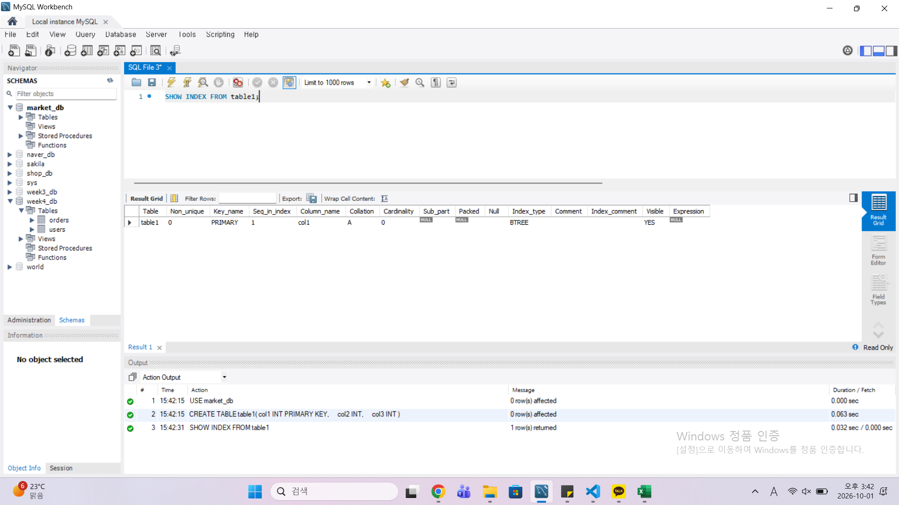
- **Key_name** 부분에 PRIMARY라고 쓰여있고, 이것은 기본 키로 설정해서 **'자동으로 생성된 인덱스'** 라는 의미이다.
- 이것이 **클러스터형 인덱스** 이다. 
+) Key_name에 PRIMARY라고 써 있다면 클러스터형 인덱스와 같은 것이라고 생각
- **Column_name** 이 col1로 설정되어 있다는 것은 col1열에 인덱스가 만들어져 있다는 것이다.
- **Non_Unique** 는 **'고유하지 않다'** 라는 뜻으로 중복이 허용된다는 의미이다. (Non-Unique가 0이라는 것은 False, 반대로 1은 True의 의미이다.)

##### 추가적인 개념 : 고유 인덱스
- **고유 인덱스** 는 인덱스의 값이 중복되지 않는다는 의미
- **단순 인덱스(Non-Unique Index)** 는 인덱스의 값이 중복되어도 된다는 의미
- **기본 키** 나 **고유 키** 로 지정하면 값이 중복되지 않으므로 고유 인덱스가 생성된다. 

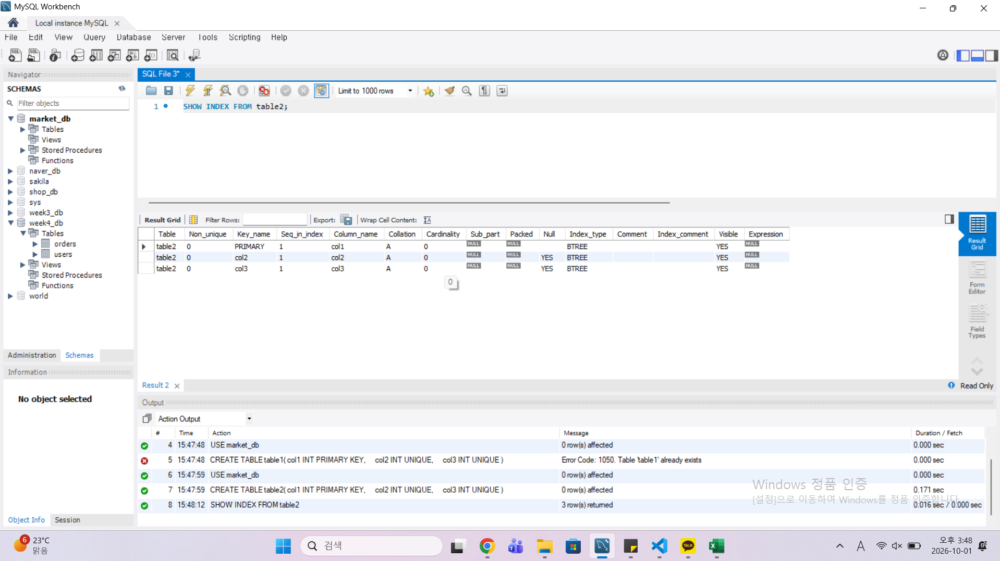
- 보조 인덱스는 고유 키로 지정하면 자동으로 생성되며, 테이블당 여러 개 만들 수 있다. (고유 키를 여러 개 지정할 수 있기 때문이다)
- **Key_name** 에 **열 이름** 이 써 있는 것은 보조 인덱스라고 볼 수 있다. 

#### 자동으로 정렬되는 클러스터형 인덱스
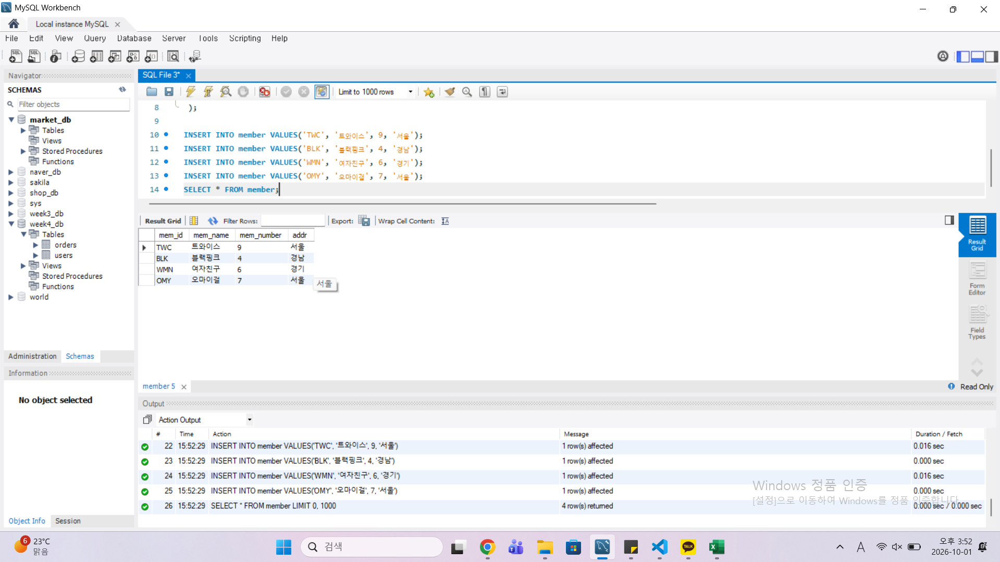
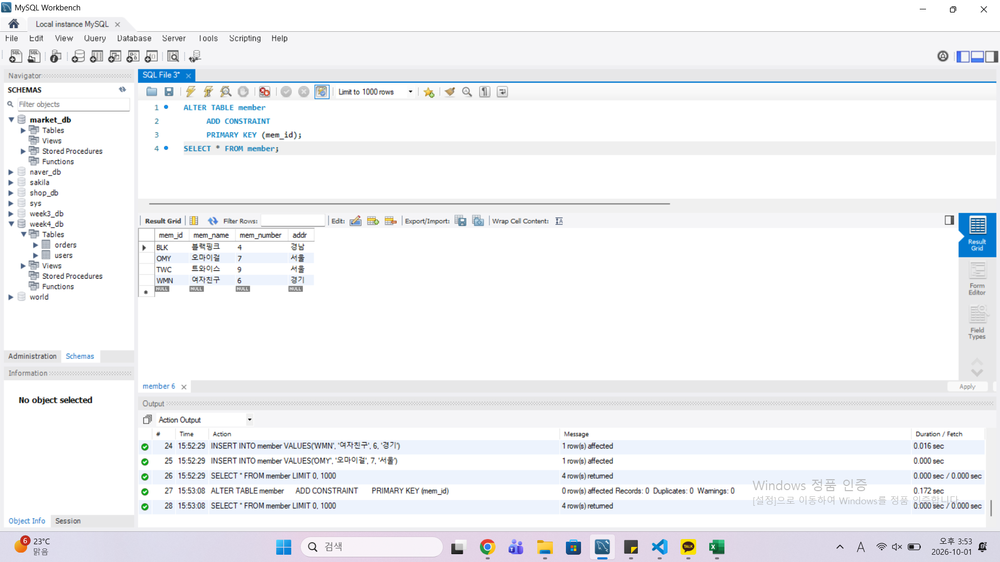
- mem_id 열을 기본키로 지정하면서 mem_id 열을 기준으로 **정렬** 되는 것을 확인할 수 있다. 
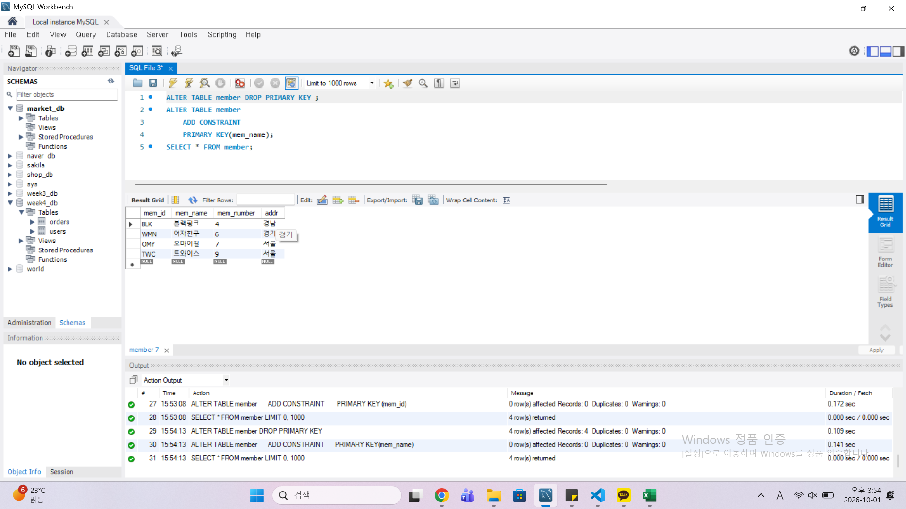
- mem_name 열을 기본 키로 설정했을 때 mem_name 열을 기준으로 **정렬** 되는 것을 확인할 수 있다.
- 이후 추가로 데이터를 입력하면 알아서 기준에 맞춰 정렬된다. 

##### 추가적인 개념 : 기본 키 변경 시 주의할 점
- 대용량의 데이터가 있는 상태에서 기본 키를 지정하면 시간이 엄청 오래 걸릴 수 있다.
- 기본 키는 중복되는 값이 존재하면 안 되기 때문에 회원 이름과 같은 열은 기본 키로 설정하면 안 된다.

#### 정렬되지 않는 보조 인덱스
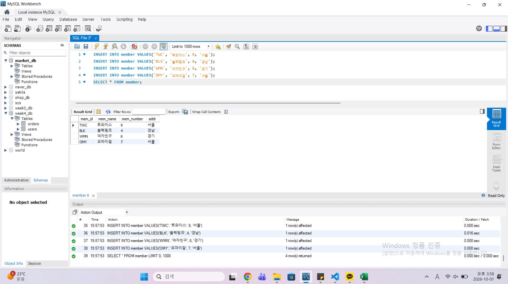
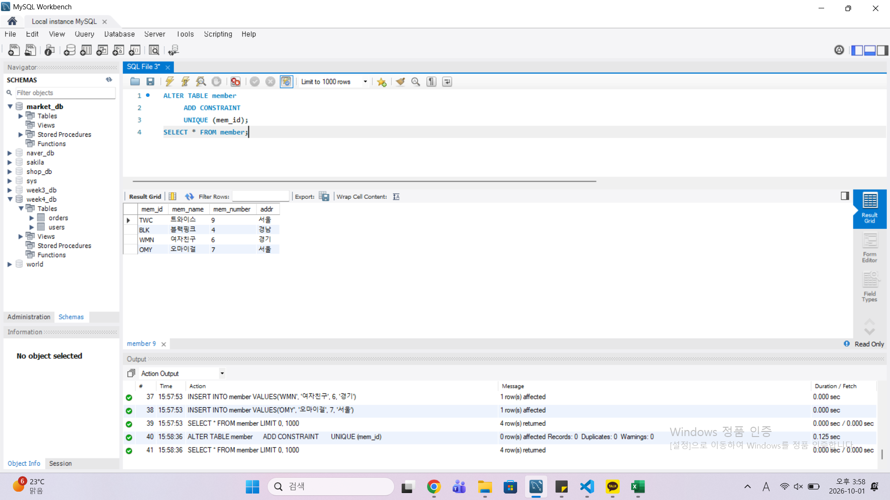
- mem_id를 고유 키로 설정하였으나 데이터의 내용이나 순서는 변경되지 않았다. 
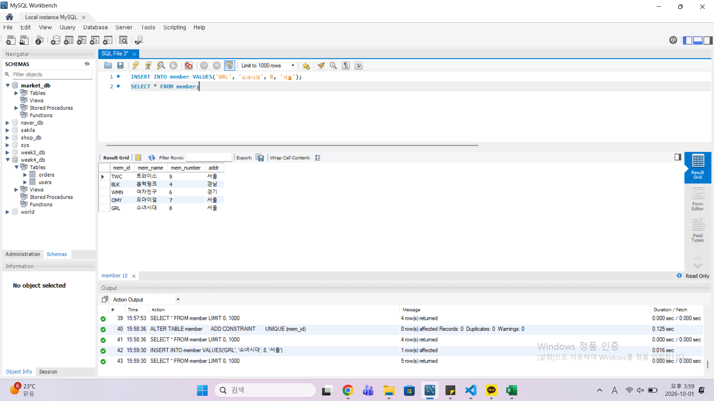
- 또한 새로운 데이터를 입력하더라도 테이블의 가장 마지막에 추가된다. 
- 보조 인덱스를 만들 때마다 데이터베이스의 공간을 차지하게 되고, 전반적으로 시스템에 오히려 나쁜 영향을 미치게 되어 **꼭 필요한 열에만 적절히 보조 인덱스를 생성하는 것이 좋다.**


> **확인문제: 다음은 인덱스 종류와 관련된 설명입니다. 가장 거리가 먼 것을 하나 고르세요.**

보기는 아래와 같습니다.
```
1️⃣ 클러스터형 인덱스는 영어사전과 비슷한 개념입니다.
2️⃣ 보조 인덱스는 일반 책의 찾아보기와 비슷한 개념입니다.
3️⃣ 클러스터형 인덱스는 기본 키를 설정하면 자동 생성됩니다.
4️⃣ 보조 인덱스는 NOT NULL을 설정하면 자동 생성됩니다.
```

```
답 : 4️⃣ 보조 인덱스는 NOT NULL을 설정하면 자동 생성됩니다.
이유 : NOT NULL은 단순히 NULL 값을 저장할 수 없도록 제한하는 제약조건일 뿐이므로 인덱스를 자동으로 만들지는 않는다. 보조 인덱스는 일반적으로 INDEX, UNIQUE 등의 설정을 통해 생성된다. 
```


## 2. 인덱스의 내부 작동 
- 클러스터형 인덱스와 보조 인덱스는 모두 내부적으로 **균형 트리** 로 만들어진다.
- **균형 트리(Balanced Tree, B-tree)** 는 '자료 구조'에 나오는 범용적으로 사용되는 데이터의 구조

### 인덱스의 내부 작동 원리
#### 균형 트리의 개념
- **노드** : 균형 트리 구조에서 데이터가 저장되는 공간
- 노드의 종류
1. **루트노드** : 노드의 가장 상위 노드 (모든 출발은 루트 노드에서 시작)
2. **리프 노드** : 제일 마지막에 존재하는 노드
3. **중간 노드(internal node)** : 루트 노드와 리프 노드의 중간에 끼인 노드

- MySQL에서는 노드 대신 **페이지** 라고 부른다. 
- **페이지** 는 최소환의 저장 단위로, 16Kbyte 크기를 가진다. (데이터 1건만 입력해도 1개 페이지가 필요)

##### 1. 균형 트리가 존재하지 않는 경우
- 균형 트리로 구성하지 않으면(인덱스가 없으면) 전체 페이지를 검색하는 방법밖에 없다. 
- 모두 **리프 페이지** 만 있으므로 처음부터 검색한다. 
- 이는 **전체 테이블 검색(Full Table Scan)** 이라고 부른다.

##### 2. 균형 트리가 존재하는 경우
- 균형 트리는 무조건 **루트 페이지** 부터 검색
- 균형 트리는 데이터를 검색할 때 (SELECT 구문을 사용할 때) 아주 뛰어난 성능을 발휘한다.

#### 균형 트리의 페이지 분할
- 인덱스를 구성하면 데이터 변경 작업(INSERT, UPDATE, DELETE) 시 성능이 나빠진다.
- **페이지 분할** 이라는 작업이 발생하여 특히 INSERT 작업이 일어날 때 더 느리게 입력될 수 있다. 
- **페이지 분할** : 새로운 페이지를 준비해서 데이터를 나누는 작업을 말한다. 

### 인덱스의 구조
#### 클러스터형 인덱스 구성하기
- 클러스터형 인덱스를 구성하면 데이터 페이지도 인덱스에 포함된다.
- 영어사전의 본문이 찾아보기의 일부라는 것과 같은 개념

#### 보조 인덱스 구성하기
- 보조 인덱스는 **데이터 페이지** 를 건드리지 않는다.
- 데이터의 위치는 **페이지 번호 +#위치** 로 기록되어 있다. 
- 보조 인덱스를 구성하면 인덱스가 별도의 공간에 만들어진다. 
- 일반 책의 찾아보기가 책 뒤에 별도로 만들어지는 것과 같은 개념이다. 

#### 인덱스에서 데이터 검색하기
- **인덱스 검색** 을 통해 클러스터형 인덱스가 보조 인덱스보다 조금 더 빠르게 원하는 결과를 검색했다.

> **확인문제: 다음 설명에서 빈칸에 공통으로 들어갈 용어를 쓰시오.**

```
인덱스를 구성하게 되면 데이터의 변경 작업(INSERT, UPDATE, DELETE)시에 성능이 나빠지는 단점이 있습니다.  
특히 INSERT 작업이 일어날 때 더 느리게 입력될 수 있는데요, 이유는 (           ) 이라는 작업이 발생하기 때문입니다.  
(            ) 작업이 일어나면 MySQL이 느려지고 너무 자주 일어나면 성능에 큰 영향을 줍니다.
```

```
**페이지 분할**
```


## 3. 인덱스의 실제 사용 
### 인덱스 생성과 제거 문법
#### 인덱스 생성 문법
- **CREATE INDEX** : Primary Key 문법이나 Unique 문법을 사용하지 않고 직접 인덱스를 생성하려고 할 때 사용하는 구문
- **CREATE UNIQUE** 로 인덱스를 생성하려면 기존에 입력된 값들에 중복이 있으면 안 된다. 

#### 인덱스 제거 문법
- **DROP INDEX** : CREATE INDEX로 생성한 인덱스를 제거할 때 사용
- **기본 키** , **고유 키** 로 자동 생성된 인덱스는 DROP INDEX로 제거하지 못한다. 
- **ALTER TABLE** 문으로 기본 키나 고유 키를 제거하여 자동으로 생성된 인덱스를 제거할 수 있다. 

### 인덱스 생성과 제거 실습
#### 인덱스 생성 실습
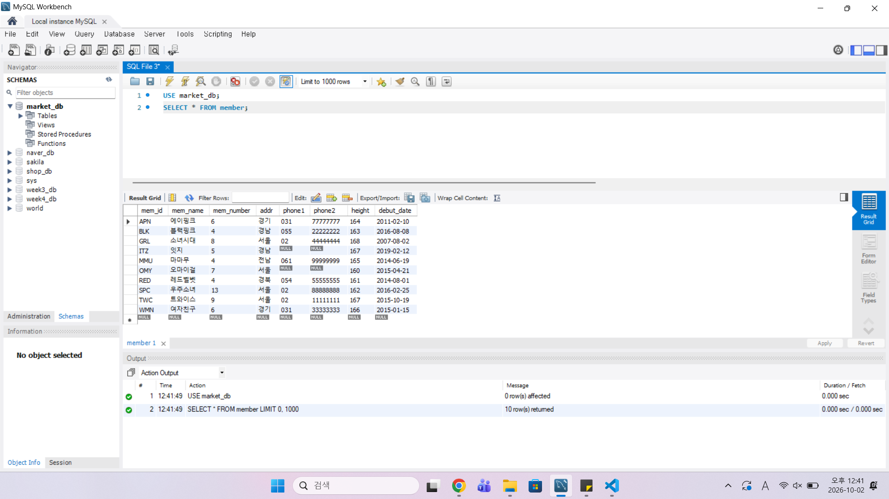
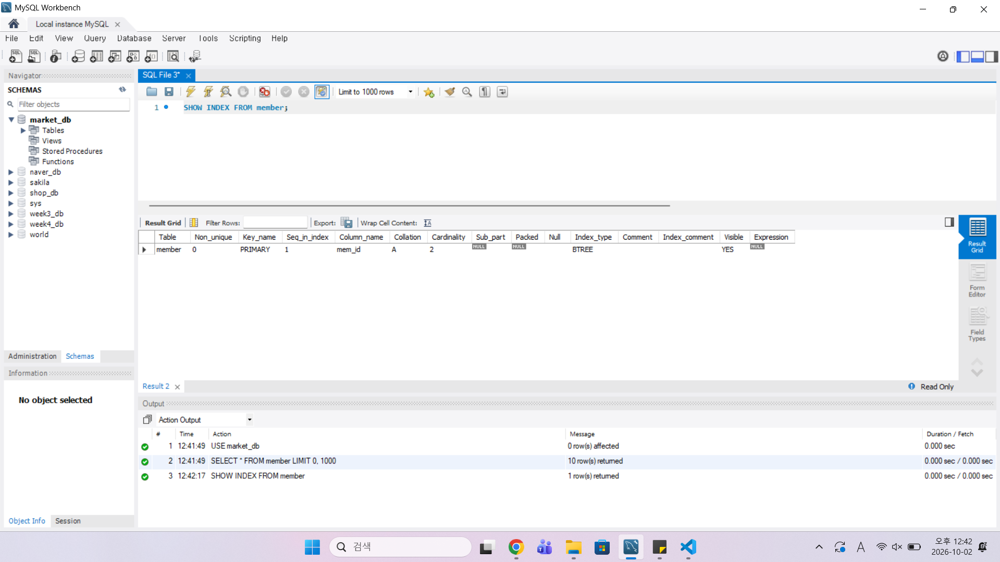

##### 인덱스의 크기를 확인
- SHOW TABLE STATUS 문을 사용
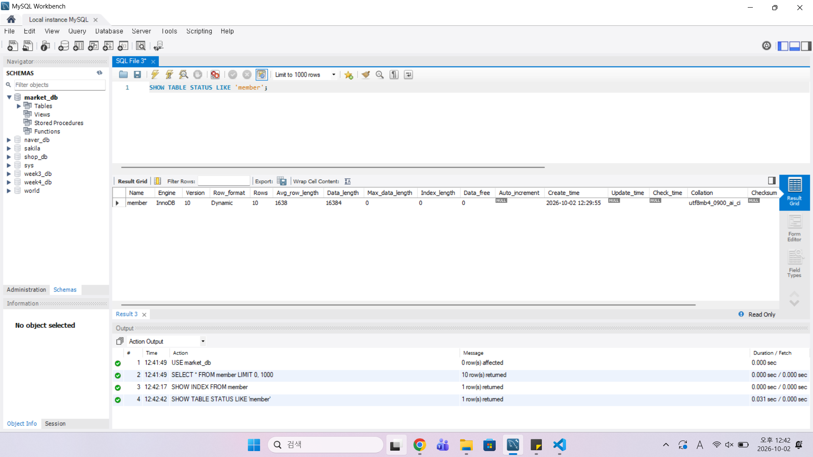

##### 단순 보조 인덱스 생성
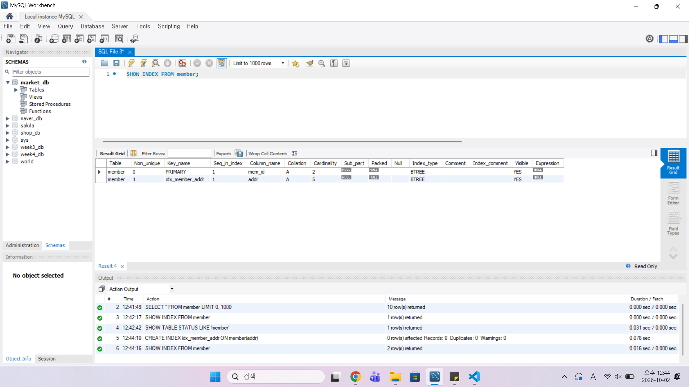
- Non_unique가 1로 설정되어 있으므로 **고유 보조 인덱스** 가 아니다. 

##### 생성한 인덱스를 실제로 적용시키기
- **ANALYZE TABLE** 문으로 먼저 테이블을 분석/처리해줘야 한다. 
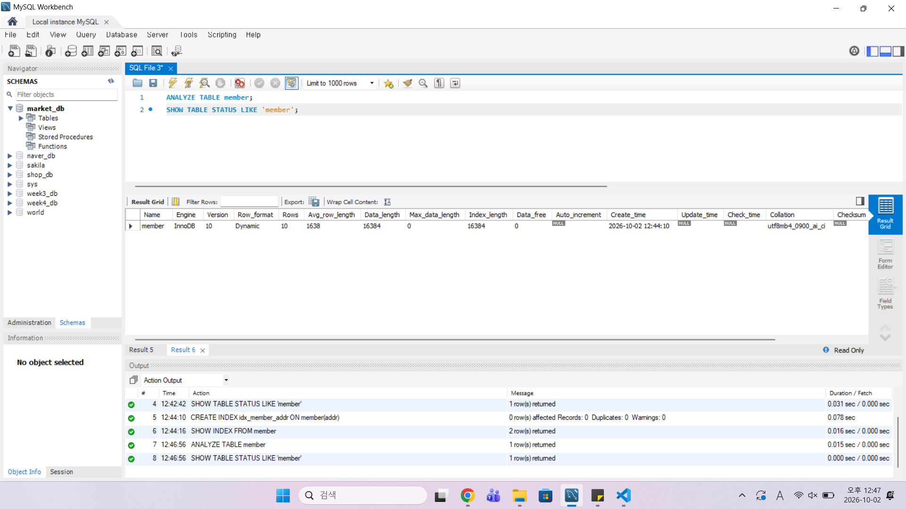

#### 인덱스의 활용 실습
- 지금까지 만든 인덱스를 모두 적용
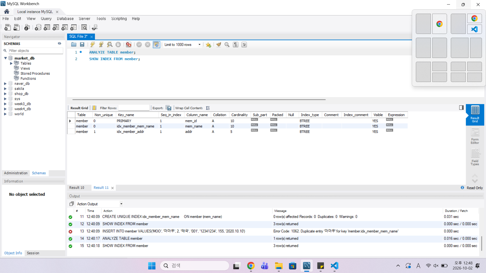

##### 인덱스가 설정되어 있지 않을 때 SELECT문 구조
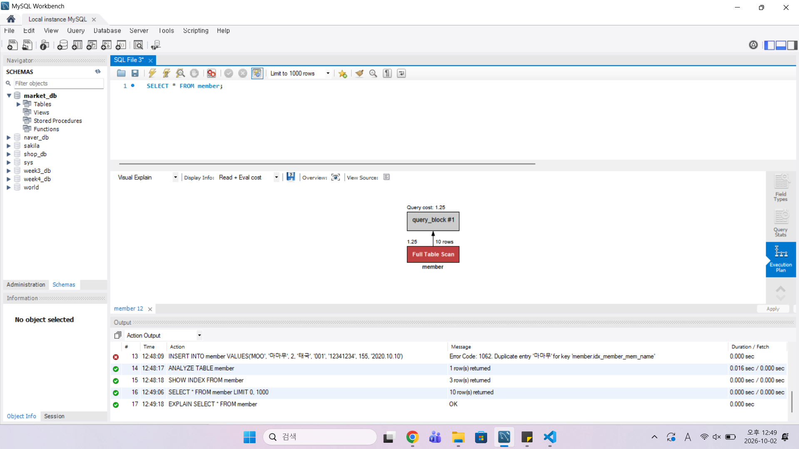

##### 인덱스가 설정되어 있을 때 SELECT문 구조
- 인덱스 적용


- Index Range Scan로 조회
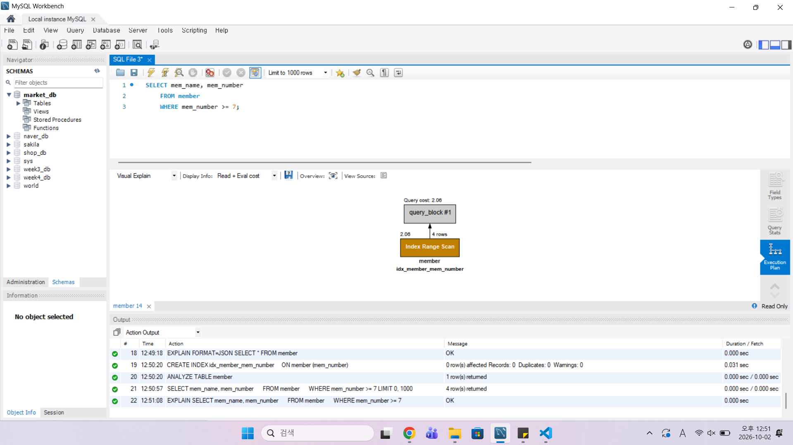

+) WHERE 절의 열에 연산을 하면 인덱스를 사용하지 않는다. 
**WHERE mem_number >= 7;** 인 경우에는 **Index Range Scan** 으로 인덱스 검색을 진행하는데 **WHERE mem_number*2 >= 14;** 와 같이 WHERE 절에 연산이 포함되어 있는 경우에는 **Full Table Scan** 으로 인덱스 검색을 진행하지 않는다. 
- **WHERE mem_number >= 14/2;** 의 경우는 **Index Range Scan** 으로 인덱스 검색을 진행한다.

#### 인덱스 제거 실습
- 클러스터형 인덱스와 보조 인덱스가 섞여 있을 때는 보조 인덱스를 먼저 제거하는 것이 좋다. (보조 인덱스는 어떤 것을 먼저 제거해도 상관없다.)
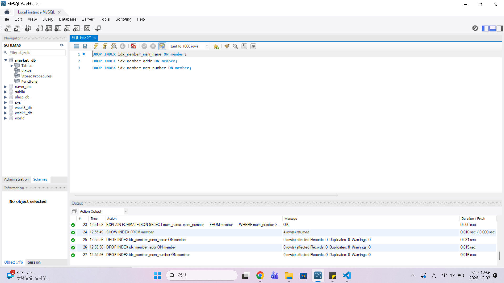
+) 클러스터형 인덱스를 먼저 제거해도 되지만, 데이터를 쓸데없이 재구성해서 시간이 더 오래 걸린다. 

##### 외래 키의 이름 조회
- information_schema 데이터베이스의 referential_constraints 테이블을 조회하면 외래 키의 이름을 알 수 있다. 
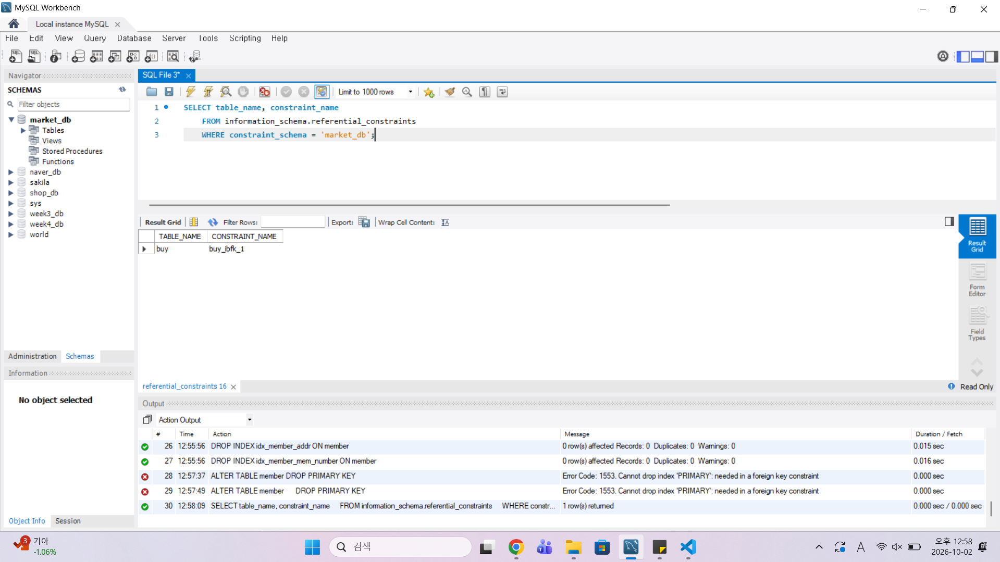

##### 기본 키 제거시 유의사항
- 기본 키를 제거하기 전에 외래 키 관계를 제거해야 한다.
- 참조 관계를 제거하지 않고 기본 키를 제거하려고 할 때 오류가 발생한다. 
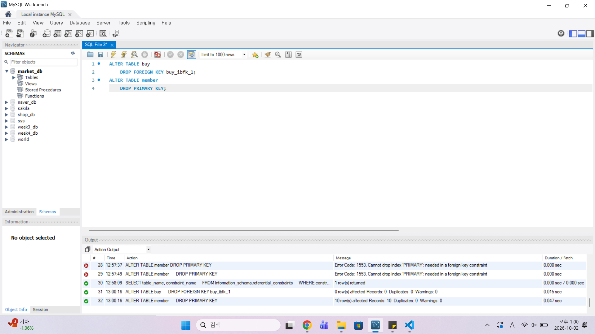

### 인덱스를 효과적으로 사용하는 방법
#### 1. 인덱스는 열 단위에 생성된다.
#### 2. WHERE 절에서 사용되는 열에 인덱스를 만들어야 한다. 
#### 3. WHERE 절에 사용되더라도 자주 사용해야 가치가 있다. 
#### 4. 데이터의 중복이 높은 인덱스를 만들어도 별 효과가 없다.
#### 5. 클러스터형 인덱스는 테이블당 하나만 생성할 수 있다.
#### 6. 사용하지 않는 인덱스는 제거한다. 

---

# 2️⃣ 실습과제

## 1. 데이터베이스 구축

아래 코드를 MySQL Workbench에 붙여넣은 후,  
**전체 드래그 → 실행 (Ctrl + Shift + Enter)** 하여 데이터베이스를 생성하세요.

```sql
CREATE DATABASE IF NOT EXISTS week5_db;
USE week5_db;

DROP TABLE IF EXISTS employees;

CREATE TABLE employees (
    emp_id INT PRIMARY KEY,
    name VARCHAR(20),
    department VARCHAR(30),
    salary INT,
    hire_date DATE
);

INSERT INTO employees VALUES
(1, '신영', 'Marketing', 3500, '2026-03-01'),
(2, '경모', 'HR', 3200, '2026-06-15'),
(3, '세원', 'IT', 4000, '2024-09-10'),
(4, '진우', 'HR', 5000, '2024-01-20'),
(5, '성환', 'Actuary', 3800, '2025-04-01'),
(6, '혜준', 'Judge', 4500, '2025-12-01'),
(7, '채은', 'HR', 3700, '2026-08-18'),
(8, '다나', 'Actuary', 3700, '2025-08-18');
```

## 2. 실습 문제

다음 문제를 수행하고 실행 결과를 캡처하여 제출하세요.

1. department 컬럼에 보조 인덱스를 생성하시오.
    - 인덱스 생성 후, `SHOW INDEX FROM employees;` 실행 결과가 보이도록 캡처합니다.
    - (idx_department 인덱스가 존재하는지 확인되어야 합니다.)
2. employees 테이블의 인덱스를 확인하시오.
3. department가 'Sales'인 직원을 조회하시오.
   - 'Sales' 조회 시, 반드시 `EXPLAIN`을 함께 실행한 화면을 캡처합니다.
   - (key 컬럼에 idx_department가 표시되어야 합니다.)
4. 생성한 인덱스를 삭제하시오.
   - 인덱스 삭제 후, 다시 `SHOW INDEX FROM employees;`를 실행하여 idx_department가 사라진 것을 확인한 화면을 캡처합니다.

## 3. 제출방법

인덱스 생성 결과, EXPLAIN 실행 결과, 인덱스 삭제 결과가 모두 보이도록 캡처하여 제출하세요.

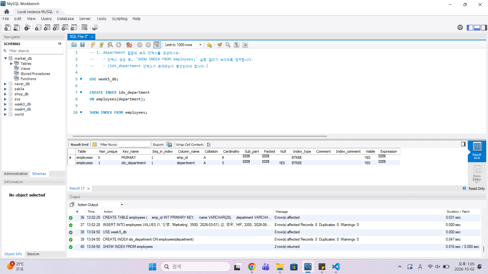
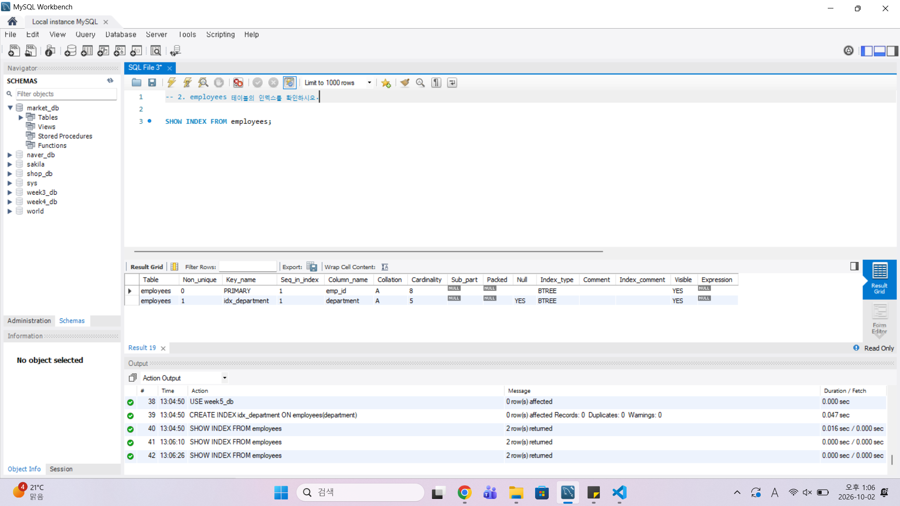
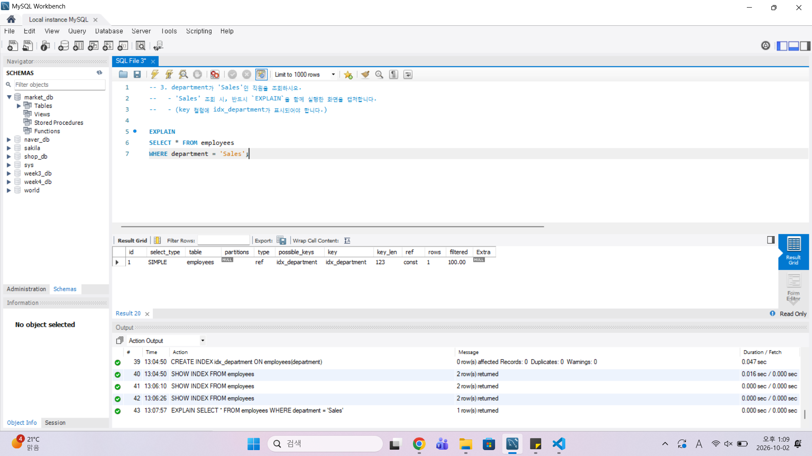
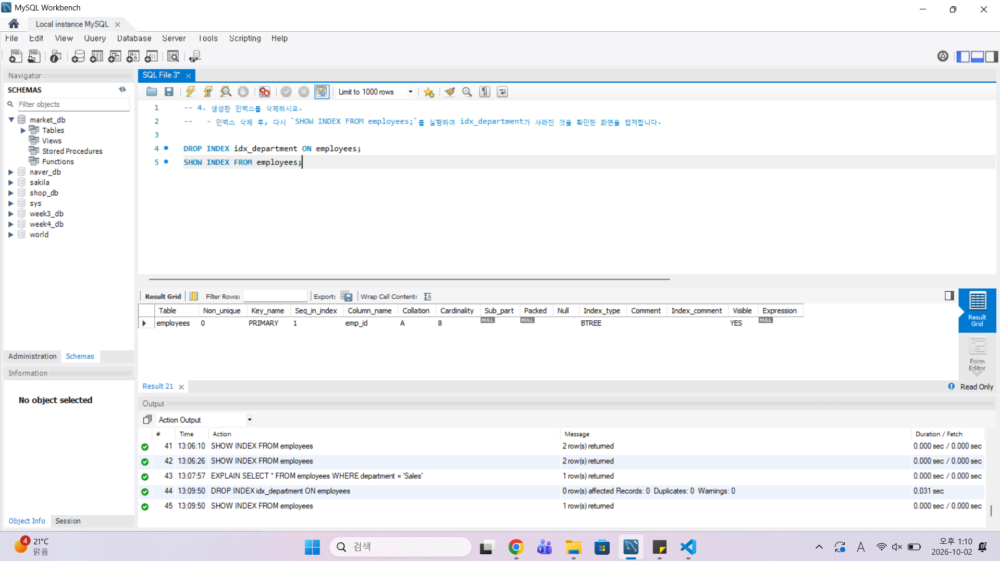


### 🎉 수고하셨습니다.


